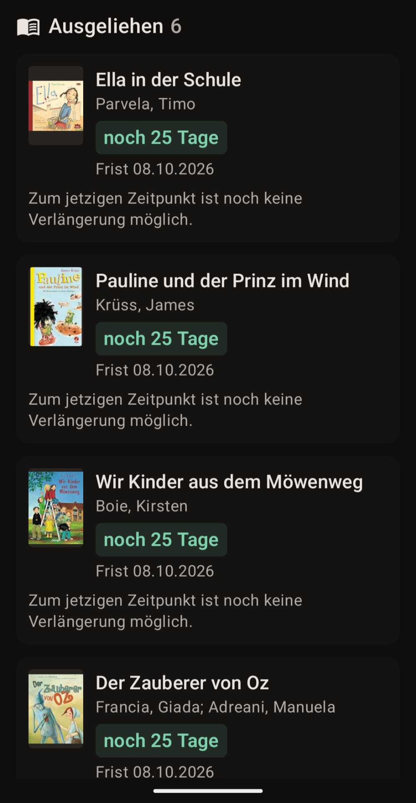
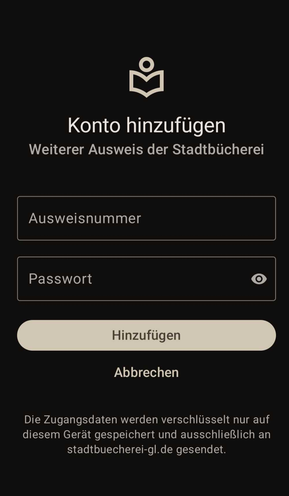
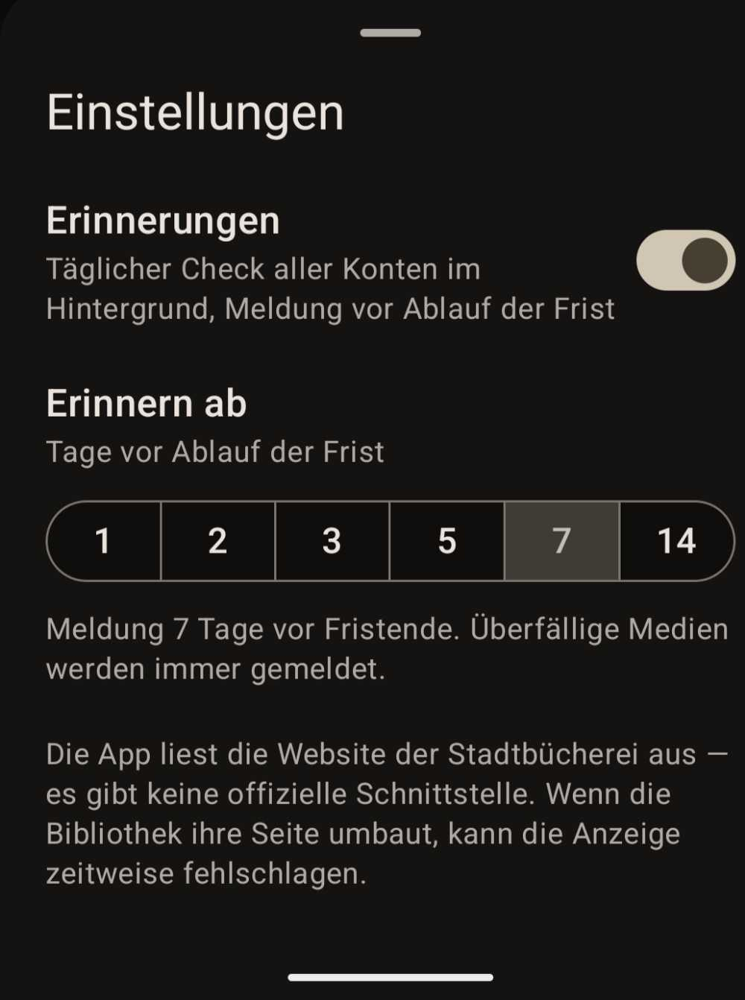

# Bib-GL-App

**Inoffizielle Android-App für die Stadtbücherei Bergisch Gladbach**

Zeigt auf einen Blick, was ausgeliehen ist, wie lange es noch bis zur Rückgabe
dauert und was sich verlängern lässt — und erinnert rechtzeitig, bevor eine
Frist abläuft.

> ⚠️ **Privates Hobbyprojekt.** Nicht von der Stadtbücherei Bergisch Gladbach
> herausgegeben, nicht mit ihr verbunden und von ihr nicht unterstützt.
> Nutzung und Installation auf eigene Verantwortung. Keine Garantie, kein Support.

---

## Screenshots

| Ausgeliehene Medien | Konto hinzufügen | Einstellungen |
|:---:|:---:|:---:|
|  |  |  |

## Was die App kann

| Funktion | Details |
|---|---|
| **Ausgeliehene Medien** | Titel, Verfasser, Mediengruppe, Zweigstelle, Cover |
| **Countdown** | Farbige Ampel bis zur Rückgabe: rot überfällig, orange ≤ 2 Tage, gelb ≤ 7 Tage, grün darüber |
| **Verlängern** | Einzeln oder alle verlängerbaren auf einmal. Nicht verlängerbare Medien zeigen den Grund („Die maximale Anzahl der Verlängerungen ist erreicht.") |
| **Gebühren** | Offene Gebühren, Einzahlungen, Saldo, Einzelposten |
| **Vormerkungen** | Vorbestellte Medien und was gerade abholbereit ist |
| **Merkliste** | Gemerkte Titel, Antippen öffnet die Detailseite |
| **Ausweis** | Warnung, wenn er in den nächsten 60 Tagen abläuft |
| **Erinnerungen** | Täglicher Hintergrund-Check, Meldung ab einstellbar 1–14 Tagen vor Fristende |
| **Mehrere Ausweise** | Umschalter in der Titelleiste — eigener Ausweis, Kinder, Partner. Jedes Konto mit eigener Vorschau und eigenen Erinnerungen |

Ohne Netz zeigt die App den zuletzt geladenen Stand, damit die Fristen auch
unterwegs sichtbar bleiben.

## Installation

1. **[APK herunterladen](https://github.com/daGrue11/Stadtbuecherei-App/releases/latest)** — unter *Assets* die Datei
   `Bib-GL-App-*.apk` antippen
2. Die Datei auf dem Android-Gerät öffnen
3. Android fragt, ob Apps aus dieser Quelle installiert werden dürfen → erlauben
4. Installieren, App öffnen, Ausweisnummer und Passwort der Stadtbücherei eingeben

Für spätere Versionen einfach den neuen APK installieren — er geht über die
vorhandene Installation drüber, die gespeicherten Konten bleiben erhalten.

### Voraussetzungen

- Android 8.0 oder neuer
- Ein gültiger Bibliotheksausweis der Stadtbücherei Bergisch Gladbach

**Getestet wurde ausschließlich unter Android 17 auf einem Pixel 10.** Ältere
Versionen sollten funktionieren, sind aber nicht ausprobiert.

## Datenschutz

Die App hat keinen Server und keine Analyse-Funktionen.

- Zugangsdaten werden **verschlüsselt auf dem Gerät** gespeichert
  (`EncryptedSharedPreferences`, Schlüssel im Android-Keystore)
- Sie werden **ausschließlich an `stadtbuecherei-gl.de`** gesendet — an
  niemanden sonst
- Es werden keinerlei Daten an den Autor oder Dritte übertragen
- Deinstallieren löscht alles

Die einzigen weiteren Netzwerkzugriffe sind die Cover-Bilder, die die
Bibliotheksseite selbst einbindet (u.a. von Amazon-Bildservern).

## Selbst bauen

Es wird kein Android Studio gebraucht — GitHub baut den APK:

```bash
git clone https://github.com/daGrue11/Stadtbuecherei-App.git
cd Stadtbuecherei-App
```

Im eigenen Fork unter **Actions** den Workflow *Android APK bauen* starten und
den APK anschließend unter *Artifacts* herunterladen. Ohne hinterlegten
Signaturschlüssel wird mit einem Debug-Schlüssel signiert — der APK läuft, kann
aber keine offizielle Version aus den Releases überschreiben.

Mit Android Studio: Projektordner öffnen, Gradle synchronisieren, `Run`.

## Wie es funktioniert

Die Stadtbücherei nutzt **OCLC OPEN** auf DotNetNuke (ASP.NET WebForms). Eine
offizielle Schnittstelle gibt es nicht, die App liest die Website aus. Das
Wesentliche steckt in [`LibraryClient.kt`](https://github.com/daGrue11/Stadtbuecherei-App/blob/main/app/src/main/java/de/bibgl/konto/data/LibraryClient.kt):

- **Login** ist ein WebForms-Postback auf `/Login` mit `__VIEWSTATE` und
  `__EVENTVALIDATION` aus dem Formular.
- **Das ganze Konto** steht danach in einer einzigen Seite `/Mein-Konto` — alle
  Reiter sind serverseitig gerendert, es braucht keinen Klick pro Reiter.
- **Verlängerbarkeit** steht *nicht* im HTML, sondern wird per AJAX von
  `PatronAccountService.asmx/IsCatalogueCopyExtendable` nachgeladen. Die App ruft
  denselben JSON-Endpunkt auf und bekommt pro Medium den Status, eine Begründung
  und das neue Fristdatum.
- **Verlängern ist zweistufig.** Der Klick auf „Verlängern" verlängert noch
  nichts, sondern öffnet den Dialog „Verlängerung bestätigen", der anfallende
  Verlängerungs- und Säumnisgebühren nennt. Erst dessen Button führt sie aus.
  Fallen Gebühren an, fragt die App vorher nach, statt sie stillschweigend zu
  akzeptieren.
- **Element-IDs** werden über ihre Endung angesprochen (`[id$=lblFeeTotalData]`),
  weil die Präfixe eine wechselnde Modulnummer enthalten — und immer auf das
  jeweilige Panel eingegrenzt, weil die Seite ausgeblendete Dialoge mit
  denselben ID-Endungen enthält.
- **Erfolg einer Verlängerung** wird daran gemessen, ob sich die Frist
  tatsächlich verschoben hat, nicht an den Meldungstexten der Seite.
- **Mehrere Konten** bekommen je einen eigenen HTTP-Client mit eigenem
  Cookie-Jar; die Seite kennt nur eine Anmeldung pro Sitzung.

Weil die App eine Website ausliest, kann ein Umbau durch die Bibliothek die
Anzeige stören. Die Selektoren sind bewusst so gewählt, dass sie Änderungen an
Layout und Modulnummern überstehen — aber eine Garantie ist das nicht.

## Technik

Kotlin · Jetpack Compose (Material 3) · OkHttp · Jsoup · WorkManager ·
EncryptedSharedPreferences · minSdk 26 · Gebaut mit GitHub Actions

## Lizenz

[MIT](LICENSE) — Nutzung, Änderung und Weitergabe sind erlaubt, solange der
Copyright-Hinweis erhalten bleibt. Ohne Gewährleistung.
